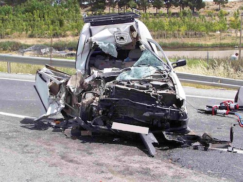
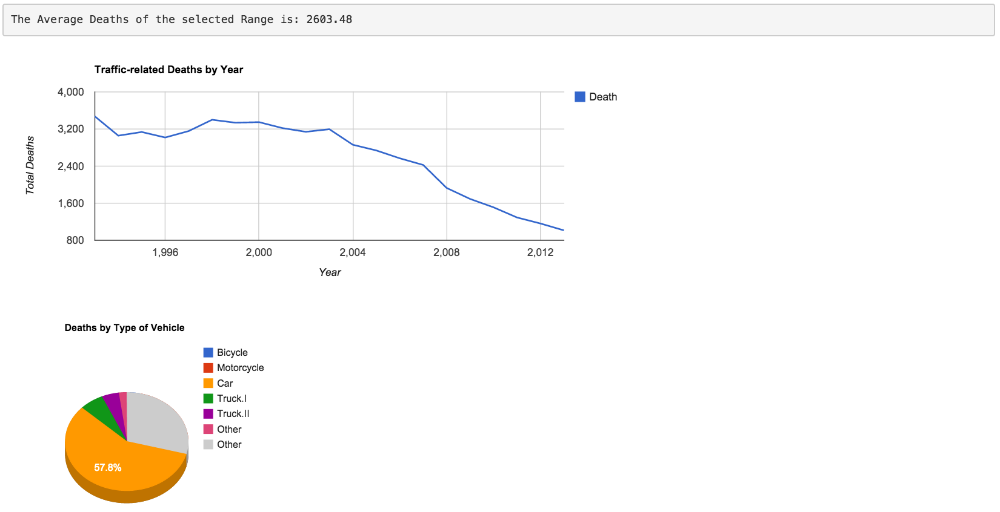

## Introduction
Are the traffic-related spanish death decreasing over the years?  
  
Do the new traffic rules and driving standard impact on the deaths?  
  
How many times have you seen the following image in the news?  
  
  


--- 
## The Tools to Explore Results Over Years


---
## R Code to Aggregating Data
The following code is used on the app to aggregate the data frame and sum the columns:

```{r}
deaths = read.csv("SpanishRoadDeaths.csv")
deaths$year = NULL
deaths$total = NULL
aggre = colSums(deaths)
data.frame(type = colnames(deaths), deaths=as.vector(aggre))
```

---
## Resources

[ShinyApp Link](https://javilinares.shinyapps.io/Project)  
  
[Github Repository for the App Source Code Link](https://github.com/javilin/DevelopingDataProductsProject)  
  
[Github Repository for the Slidify presentation Source Code Link](https://github.com/javilin/DevelopingDataProductsProjectSlides)  
  
[Data Source Link](http://www.dgt.es/es/seguridad-vial/estadisticas-e-indicadores/accidentes-30dias/series-historicas/)  
